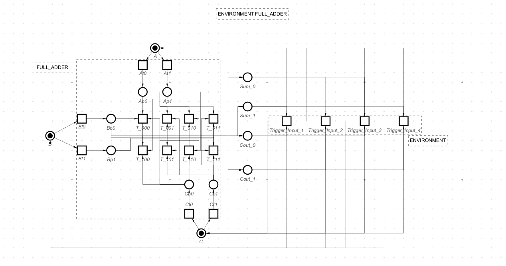
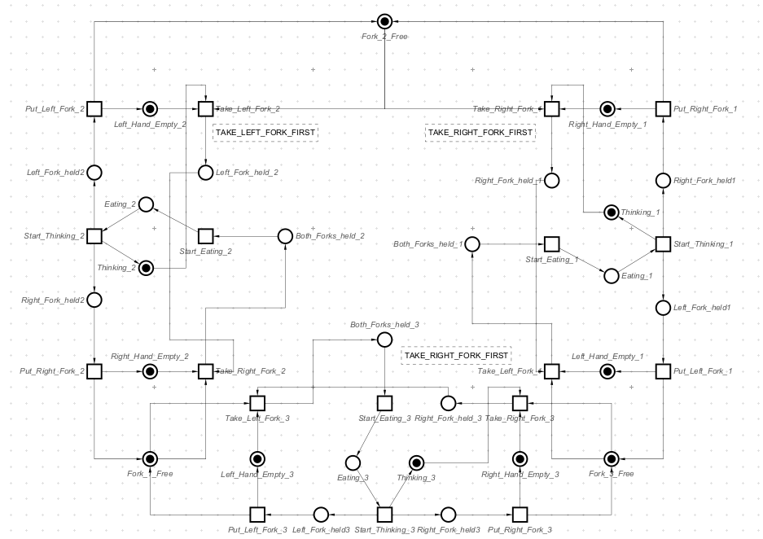
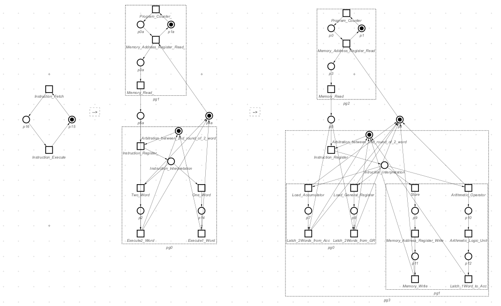
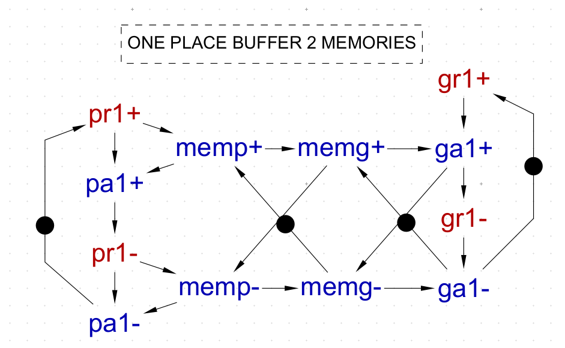
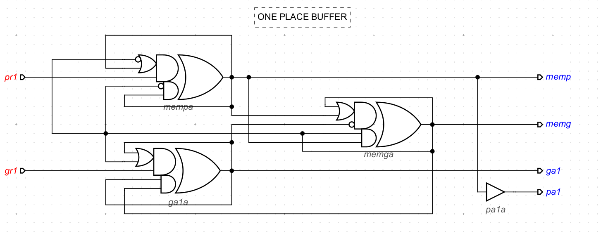
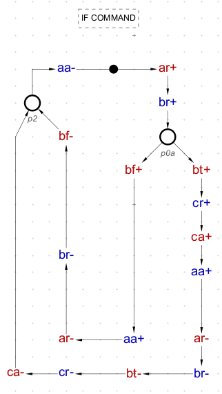
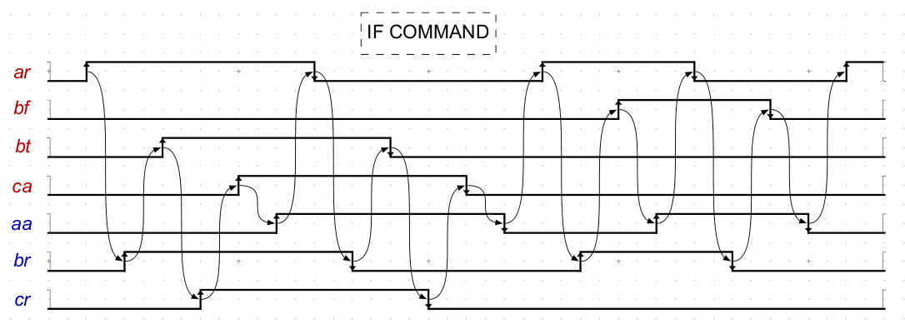

# IC Design

This repository contains various integrated circuit (IC) designs and system models created to demonstrate a range of concepts and techniques in digital design and asynchronous control systems.

---

## Table of Contents

1. [Logic Gate Modelling](#logic-gate-modelling)
2. [Buffer and Frequency Divider Modelling](#buffer-and-frequency-divider-modelling)
3. [Arbitration Systems](#arbitration-systems)
4. [Simple CPU Design](#simple-cpu-design)
5. [Serial Multiplier Design](#serial-multiplier-design)
6. [Multi-Place Buffer Design](#multi-place-buffer-design)
7. [Asynchronous Controller Circuits](#asynchronous-controller-circuits)

---

## Logic Gate Modelling

- **Models:**
  - Half-Adder (HA)
  - Full-Adder (FA)
- **Techniques Used:**
  - Truth table-based modelling
  - Logic gate-based modelling (AND, XOR, OR)
  - Deadlock-freeness environment for system continuity
- **Key Highlights:**
  - Modular and scalable design.
  - Addressed deadlocks using synchronization mechanisms.

---

## Buffer and Frequency Divider Modelling

- **Models:**
  - Multi-Place Buffers (FIFO, LIFO)
  - Multi-Stage Frequency Divider
- **Key Highlights:**
  - Designed FIFO buffers for sequential data processing.
  - Created a frequency divider for efficient clock signal management.
  - Explored state transitions and concurrency management.

---

## Arbitration Systems

- **Model:**
  - Dining Philosophers Problem
- **Key Highlights:**
  - Implemented priority-based arbitration to prevent deadlocks.
  - Designed using Petri nets to ensure fairness and liveness.

---

## Simple CPU Design

- **Components:**
  - Accumulator (Acc)
  - General Register (GR)
  - Program Counter (PC)
  - Instruction Register (IR)
  - Instruction Decoder (ID)
- **Key Highlights:**
  - Designed a pipelined CPU model with concurrency management.
  - Addressed potential deadlocks and introduced dependency constraints.

---

## Serial Multiplier Design

- **Model:**
  - Serial multiplier for 4-bit numbers.
- **Key Highlights:**
  - Iterative and self-timed approach for multiplication.
  - Eliminated global clock dependency using a reset-based control mechanism.

---

## Multi-Place Buffer Design

- **Models:**
  - Refined FIFO buffers and frequency dividers.
  - Designed a 4-Place buffer with Selector (SEL) and Multiplexer (MUX).
- **Key Highlights:**
  - Integrated memory stability mechanisms.
  - Resolved CSC conflicts for safe and deadlock-free operation.

---

## Asynchronous Controller Circuits

- **Models:**
  - `IF` Conditional Circuit
  - `DO-While` Loop Circuit
- **Key Highlights:**
  - Implemented OR-causality and parallelism.
  - Managed delay insensitivity and synchronization challenges.

---
